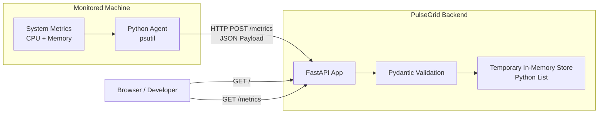
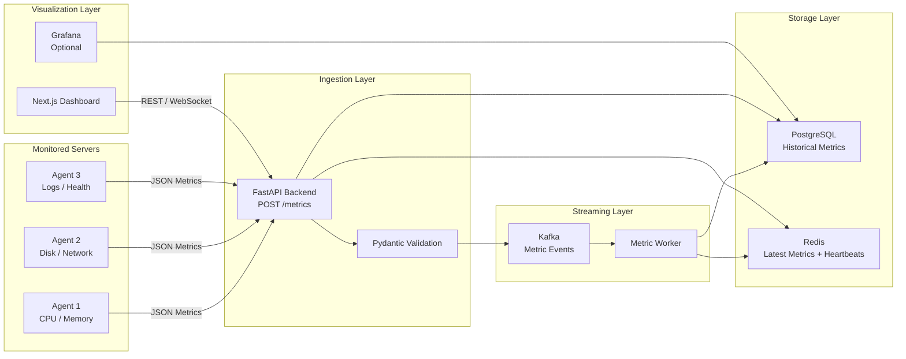

  

# PulseGrid

PulseGrid is a distributed event monitoring platform inspired by tools like Datadog. It collects server metrics from lightweight agents, sends them to a backend API, stores historical data, and displays real-time system health on a dashboard.

## Architecture

### Current Phase 2 Architecture

The current Phase 2 implementation uses a Python agent to collect local machine metrics (CPU and memory) and send them as JSON to a FastAPI backend. The backend validates payloads with Pydantic and keeps received metrics in a temporary in-memory store.

### Future Target Architecture

The target architecture expands PulseGrid into a production-ready pipeline where monitored servers send metrics to an ingestion layer, stream through Kafka workers, persist to PostgreSQL and Redis, and power dashboard visualization.

## Planned Features

- Server agents for CPU, memory, disk, and network metrics
- FastAPI backend for metric ingestion
- PostgreSQL for historical metric storage
- Redis for latest metric cache and agent heartbeat tracking
- Kafka for event streaming
- Next.js dashboard for real-time monitoring
- Docker-based local development environment
- Alerting for unhealthy services
## Tech Stack

- **Frontend:** Next.js, TypeScript, Tailwind
- **Backend:** FastAPI, Python
- **Database:** PostgreSQL
- **Cache:** Redis
- **Streaming:** Kafka
- **Infrastructure:** Docker, AWS
- **Monitoring:** Prometheus, Grafana

## Project Structure

- agent/ - Lightweight monitoring agent
- backend/ - API and ingestion service
- frontend/ - Web dashboard
- infra/ - Docker and deployment files
- docs/ - Architecture notes

## Current Goal

Build the first MVP:

1. Create a Python agent that collects CPU and memory usage.
2. Send metrics to a FastAPI backend.
3. Store metrics in PostgreSQL.
4. Display latest metrics in a Next.js dashboard.
