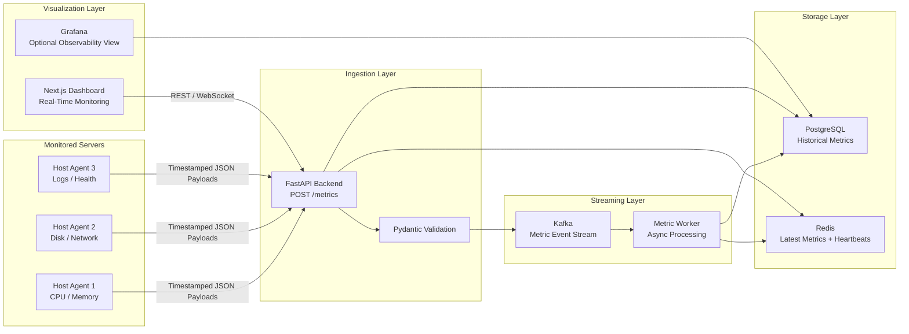
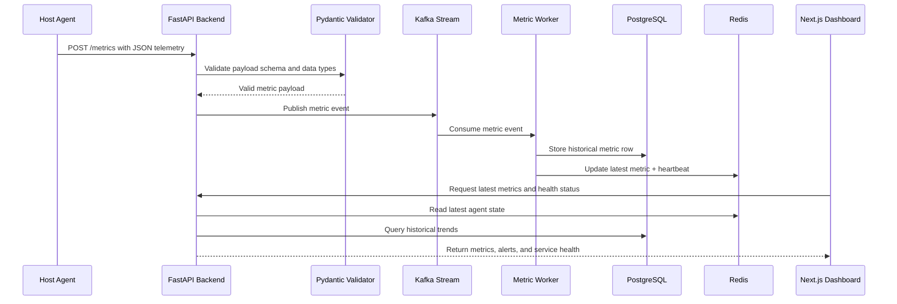
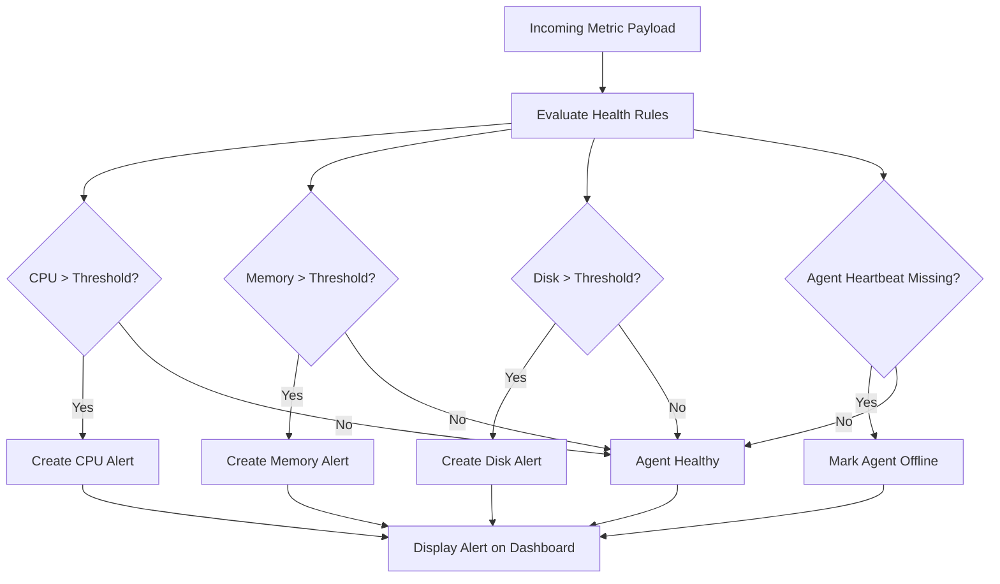

<p align="center">
  
</p>

# PulseGrid

**PulseGrid** is a distributed infrastructure monitoring platform inspired by Datadog, Prometheus, and Grafana. It collects host-level telemetry from lightweight agents, streams metrics through a backend ingestion pipeline, stores historical data, caches latest service state, and visualizes real-time infrastructure health through a multi-agent dashboard.

---

## Overview

PulseGrid monitors distributed services by collecting:

* CPU usage
* Memory usage
* Disk usage
* Network activity
* Application logs
* Agent heartbeats
* Service health signals
* Threshold-based alerts
* Historical metric trends

The system is designed to model the core architecture behind modern observability platforms: agent-based telemetry collection, backend metric ingestion, persistent time-series storage, low-latency latest-state caching, event streaming, and real-time dashboard visualization.

---

## Architecture

### System Architecture



### Metric Ingestion Flow



### Service Health and Alerting Flow



---

## Features

* Lightweight host agents for collecting CPU, memory, disk, network, logs, and health telemetry
* FastAPI backend for high-throughput metric ingestion
* Pydantic schema validation for incoming JSON payloads
* PostgreSQL persistence for historical metric storage and trend analysis
* Redis caching for latest metrics, heartbeat state, and service health
* Kafka-based event streaming for asynchronous metric processing
* Background worker pipeline for processing and storing metric events
* Threshold-based alerts for unhealthy resource usage
* Offline agent detection using heartbeat tracking
* Real-time multi-agent dashboard built with Next.js and TypeScript
* Docker Compose setup for reproducible local infrastructure
* Optional Prometheus and Grafana integration for observability comparison

---

## Tech Stack

| Layer          | Technologies                      |
| -------------- | --------------------------------- |
| Agents         | Python, psutil                    |
| Backend        | FastAPI, Pydantic                 |
| Database       | PostgreSQL                        |
| Cache          | Redis                             |
| Streaming      | Kafka                             |
| Workers        | Python background workers         |
| Frontend       | Next.js, TypeScript, Tailwind CSS |
| Infrastructure | Docker, Docker Compose            |
| Monitoring     | Prometheus, Grafana               |

---

## Project Structure

```txt
pulsegrid/
├── agent/        # Lightweight host telemetry agent
├── backend/      # FastAPI ingestion API and database logic
├── frontend/     # Next.js monitoring dashboard
├── infra/        # Docker Compose and infrastructure configuration
├── docs/         # Architecture notes and design documentation
├── assets/       # README images and project visuals
└── README.md
```

---

## Core API Routes

| Method | Route      | Purpose                                    |
| ------ | ---------- | ------------------------------------------ |
| GET    | `/`        | Backend health check                       |
| POST   | `/metrics` | Receive metric payloads from agents        |
| GET    | `/metrics` | Retrieve recent stored metrics             |
| GET    | `/agents`  | Retrieve monitored agents and health state |
| GET    | `/alerts`  | Retrieve active and historical alerts      |
| GET    | `/health`  | Return backend and service health status   |

---

## Example Metric Payload

```json
{
  "agent_id": "server-1",
  "hostname": "server-1.internal",
  "cpu_percent": 42.5,
  "memory_percent": 76.3,
  "memory_used": 6280265728,
  "memory_total": 17179869184,
  "disk_percent": 64.1,
  "network_sent": 204812,
  "network_received": 984120,
  "timestamp": "2026-06-11T01:59:59.817946"
}
```

---

## Local Development

### Start Infrastructure

```bash
cd infra
docker compose up -d
```

### Run Backend

```bash
cd backend
source .venv/bin/activate
uvicorn main:app --reload
```

### Run Agent

```bash
cd agent
source .venv/bin/activate
python3 agent.py
```

### View API Docs

```txt
http://127.0.0.1:8000/docs
```

### Query PostgreSQL Directly

```bash
docker exec -it pulsegrid-postgres psql -U pulsegrid -d pulsegrid
```

```sql
\dt

SELECT id, agent_id, hostname, cpu_percent, memory_percent, timestamp
FROM metric
ORDER BY id DESC
LIMIT 5;
```

---

## Dashboard Capabilities

The PulseGrid dashboard provides:

* Live CPU and memory monitoring
* Disk and network utilization charts
* Multi-agent service health overview
* Historical trend visualization
* Alert activity feed
* Offline agent detection
* Latest heartbeat status
* Real-time infrastructure health cards

---


## Extensions / Production-Grade Improvements

Future production-focused extensions include:

* Agent retry logic with exponential backoff and local buffering
* Duplicate metric protection using idempotency keys
* Agent authentication with API keys or mTLS
* Batch database writes for high-volume ingestion
* Time-series optimization with indexing, partitioning, retention policies, or TimescaleDB
* WebSocket or Server-Sent Events support for live dashboard updates
* Multi-agent testing across local machines, Docker containers, and cloud instances
* Agent packaging with Docker or compiled binaries
* Internal observability for PulseGrid using Prometheus and Grafana
* Rate limiting, request validation, and secret management
* Optional Go or Rust rewrites for lower-overhead agents and high-throughput workers
